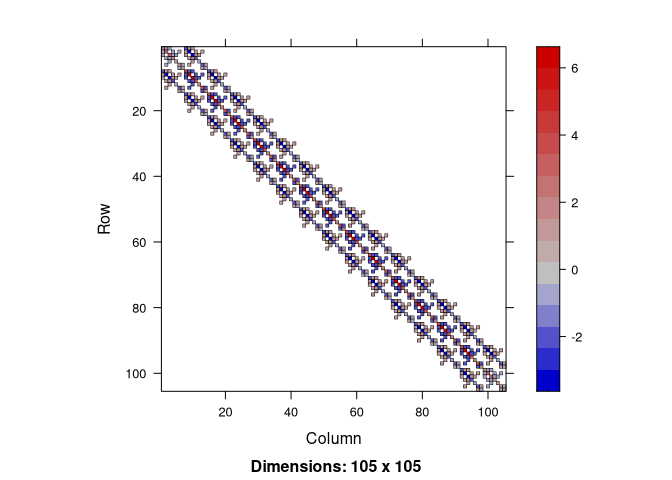
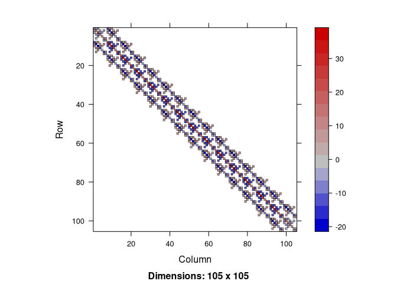
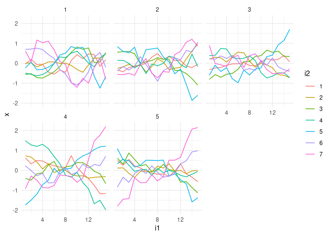
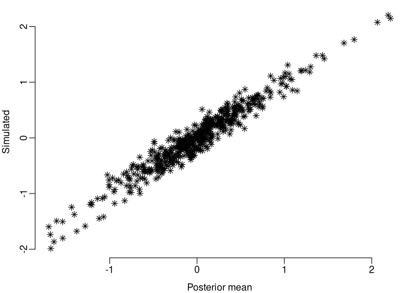

<!-- README.md is generated from README.Rmd. Please edit that file -->

# INLAtools

<!-- badges: start -->

[](https://cran.r-project.org/package=INLAtools)
[](https://cran.r-project.org/package=INLAtools)
<!-- badges: end -->

Contain code to work with a C struct, in short cgeneric, to define a
Gaussian Markov random (GMRF) model. The cgeneric contain code to
specify GMRF elements such as the graph and the precision matrix, and
also the initial and prior for its parameters, useful for model
inference. It can be accessed from a C program and is the recommended
way to implement new GMRF models in the ‘INLA’ package
(<https://www.r-inla.org>). The ‘INLAtools’ implement functions to
evaluate each one of the model specifications from R. The implemented
functionalities leverage the use of ‘cgeneric’ models and provide a way
to debug the code as well to work with the prior for the model
parameters and to sample from it. A very useful functionality is the
Kronecker product method that creates a new model from multiple cgeneric
models. It also works with the rgeneric, the R version of the cgeneric
intended to easy try implementation of new GMRF models. The Kronecker
between two cgeneric models can be used to build the spatio-temporal
intrinsic interaction models [Knorr-Held
(2000)](https://onlinelibrary.wiley.com/doi/10.1002/1097-0258%2820000915/30%2919%3A17/18%3C2555%3A%3AAID-SIM587%3E3.0.CO%3B2-%23)
for what the needed constraints are automatically set as in the example
below.

## Installation

The ‘INLA’ package is a suggested one, but you will need it for actually
fitting a model. You can install it with

``` r
install.packages("INLA",repos=c(getOption("repos"),INLA="https://inla.r-inla-download.org/R/testing"), dep=TRUE) 
```

You can install the current [CRAN](https://CRAN.R-project.org) version
of INLAtools:

``` r
install.packages("INLAtools")
```

You can install the latest version of INLAtools from
[GitHub](https://github.com/eliaskrainski/INLAtools) with

``` r
## install.packages("remotes")
remotes::install_github("eliaskrainski/INLAtools")
```

## Example:

Build a Kronecker product model where the precision is given as
$$ \mathbf{Q} = \tau \mathbf{R}_1 \otimes \mathbf{R}_2 $$

``` r
library(Matrix)
## first
n1 <- 15
(R1 <- crossprod(diff(Diagonal(n1))))
#> 15 x 15 sparse Matrix of class "dsCMatrix"
#>                                                   
#>  [1,]  1 -1  .  .  .  .  .  .  .  .  .  .  .  .  .
#>  [2,] -1  2 -1  .  .  .  .  .  .  .  .  .  .  .  .
#>  [3,]  . -1  2 -1  .  .  .  .  .  .  .  .  .  .  .
#>  [4,]  .  . -1  2 -1  .  .  .  .  .  .  .  .  .  .
#>  [5,]  .  .  . -1  2 -1  .  .  .  .  .  .  .  .  .
#>  [6,]  .  .  .  . -1  2 -1  .  .  .  .  .  .  .  .
#>  [7,]  .  .  .  .  . -1  2 -1  .  .  .  .  .  .  .
#>  [8,]  .  .  .  .  .  . -1  2 -1  .  .  .  .  .  .
#>  [9,]  .  .  .  .  .  .  . -1  2 -1  .  .  .  .  .
#> [10,]  .  .  .  .  .  .  .  . -1  2 -1  .  .  .  .
#> [11,]  .  .  .  .  .  .  .  .  . -1  2 -1  .  .  .
#> [12,]  .  .  .  .  .  .  .  .  .  . -1  2 -1  .  .
#> [13,]  .  .  .  .  .  .  .  .  .  .  . -1  2 -1  .
#> [14,]  .  .  .  .  .  .  .  .  .  .  .  . -1  2 -1
#> [15,]  .  .  .  .  .  .  .  .  .  .  .  .  . -1  1
```

``` r
G2 <- sparseMatrix(
  i = c(1,1,2,2,3,3,6), 
  j = c(2,3,4,6,4,5,7), 
  symmetric = TRUE)
(n2 <- nrow(G2)) 
#> [1] 7
R2 <- Diagonal(n = n2, x = colSums(G2)) - G2
R2
#> 7 x 7 sparse Matrix of class "dsCMatrix"
#>                          
#> [1,]  2 -1 -1  .  .  .  .
#> [2,] -1  3  . -1  . -1  .
#> [3,] -1  .  3 -1 -1  .  .
#> [4,]  . -1 -1  2  .  .  .
#> [5,]  .  . -1  .  1  .  .
#> [6,]  . -1  .  .  .  2 -1
#> [7,]  .  .  .  .  . -1  1
```

``` r
image(kronecker(R1, R2))
```



Notice that the order of the resulting matrix.

## Define the `cgeneric` models

We will use the ‘cgeneric0’ model for each. This model is written with
precision matrix equal $\tau \mathbf{R}$ where the matrix $\mathbf{R}$
is the precision structure matrix and $\tau$ is the precision parameter.
A precision parameter multiplied by a precision structure is a local
precision. A scaling, as proposed in [Sørbye & Rue
(2014)](https://www.sciencedirect.com/science/article/pii/S2211675313000407),
is applied by default in the following code

``` r
library(INLAtools)
#> Loading required package: inlabru
#> Loading required package: fmesher
cg1 <- cgeneric(
    model = "generic0", 
    R = R1, ## precision structure matrix
    param = c(1, 0.05)) ## P(sigma > 1) = 0.05
```

where the prior is a PC-prior, as proposed in [Simpson et.
al. (2017)](https://projecteuclid.org/journals/statistical-science/volume-32/issue-1/Penalising-Model-Component-Complexity--A-Principled-Practical-Approach-to/10.1214/16-STS576.full).

For the second model we also use the `cgeneric0` but fix the parameter
to 1, leaving the precision matrix from the first model as the one for
the resulting precision matrix.

``` r
cg2 <- cgeneric(
    model = "generic0", 
    R = R2, ## precision structure matrix
    param = c(1, NA)) ## fix sigma = 1
```

The resulting Kronecker product model is

``` r
cg12 <- kronecker(cg1, cg2)
(N <- cg12$f$n)
#> [1] 105
tau <- 4
Q <- prec(cg12, theta = log(tau))
image(Q)
```



Note: the scaling makes $\sigma = \tau^{-0.5}$ a marginal standard
deviation parameter.

## Fit the model to some data

Simulate $k=5$ samples (replicates) from the Kronecker product model

``` r
library(INLA)
k <- 5
xx <- inla.qsample(
  n = k, 
  Q = Q + Diagonal(N, 1e-9), 
  constr = cg12$f$extraconstr, 
  seed = 1
)
#> Warning in inla.qsample(n = k, Q = Q + Diagonal(N, 1e-09), constr =
#> cg12$f$extraconstr, : Since 'seed!=0', parallel model is disabled and serial
#> model is selected
apply(xx, 2, summary)
#>              sample:1      sample:2      sample:3      sample:4      sample:5
#> Min.    -1.244648e+00 -1.921912e+00 -8.876440e-01 -8.104780e-01 -1.195814e+00
#> 1st Qu. -4.227780e-01 -3.927394e-01 -2.466591e-01 -2.647159e-01 -2.574487e-01
#> Median   8.474877e-03  5.005800e-02 -2.834700e-02  2.188409e-02 -2.665859e-02
#> Mean    -1.054734e-12  3.951671e-13 -3.884818e-13  1.512079e-14  6.087083e-13
#> 3rd Qu.  4.315217e-01  4.220450e-01  2.283570e-01  2.644288e-01  3.051810e-01
#> Max.     1.166829e+00  1.814482e+00  1.762854e+00  8.952277e-01  9.702742e-01
```

Plot each replicate per group

``` r
dataf <- data.frame(
  i1 = rep(rep(1:n1, each = n2), k),
  i2 = factor(rep(rep(1:n2, n1), k)),
  i = rep(1:N, k), 
  r = rep(1:k, each = N),
  x = as.vector(xx)
)
head(dataf, 10)
#>    i1 i2  i r            x
#> 1   1  1  1 1 -0.034627319
#> 2   1  2  2 1  0.002663663
#> 3   1  3  3 1 -0.562134730
#> 4   1  4  4 1 -0.493268793
#> 5   1  5  5 1 -0.228196484
#> 6   1  6  6 1  0.695164926
#> 7   1  7  7 1  0.620398736
#> 8   2  1  8 1  0.199000730
#> 9   2  2  9 1  0.027308761
#> 10  2  3 10 1 -0.520617245

library(ggplot2)
ggplot(dataf) + theme_minimal() + 
  geom_line(aes(x = i1, y = x, group = i2, color = i2)) + 
  facet_wrap(~r)
```



Simulate observations considering a Poisson model as

``` r
dataf$y <- rpois(N * k, exp(3 + dataf$x))
```

Fit the model with a call to the main `INLA` function:

``` r
fit <- inla(
    formula = y ~ f(i, model = cg12, replicate = r),
    family = "poisson", 
    data = dataf)
```

Summary of the intercept and $\tau$ posterior marginals

``` r
fit$summary.fixed
#>                 mean         sd 0.025quant 0.5quant 0.975quant     mode
#> (Intercept) 2.989044 0.01031124   2.968818 2.989047   3.009256 2.989047
#>                     kld
#> (Intercept) 7.51826e-11
fit$summary.hyperpar
#>                  mean        sd 0.025quant 0.5quant 0.975quant     mode
#> Theta1 for i 1.728661 0.1172793   1.498137 1.728913   1.957804 1.729409
```

Scatterplot of the posterior mode and simulated

``` r
par(mar = c(3,3,0.5,0.5), mgp = c(2,0.5,0), bty = "n")
plot(fit$summary.random$i$mean, xx, pch = 8,
     xlab = "Posterior mean", ylab = "Simulated")
```



Posterior marginal summary for $\sigma=\tau^{-1/2}$:

``` r
pm.sigma <- inla.tmarginal(
  fun = function(x) exp(-x/2), ## from log(tau) to sigma
  marginal = fit$internal.marginals.hyperpar[[1]])
1/sqrt(tau)
#> [1] 0.5
inla.zmarginal(pm.sigma)
#> Mean            0.422047 
#> Stdev           0.0246101 
#> Quantile  0.025 0.37588 
#> Quantile  0.25  0.404949 
#> Quantile  0.5   0.42124 
#> Quantile  0.75  0.438237 
#> Quantile  0.975 0.472519
```
