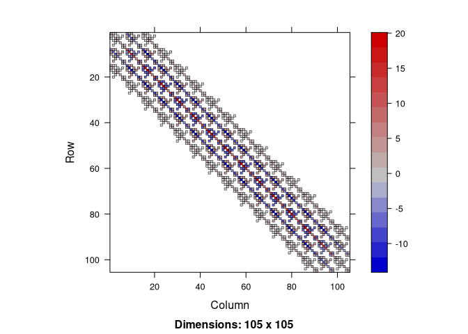
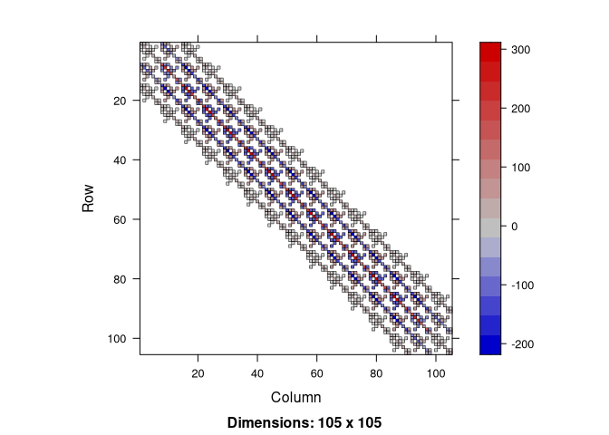
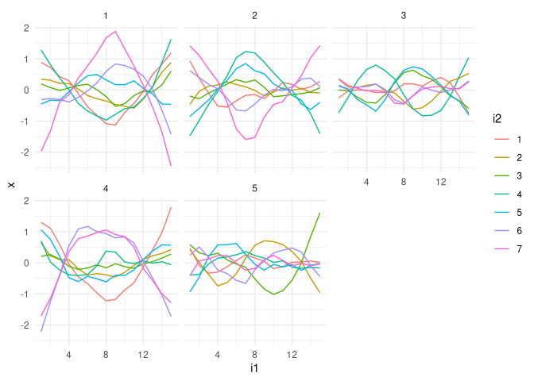
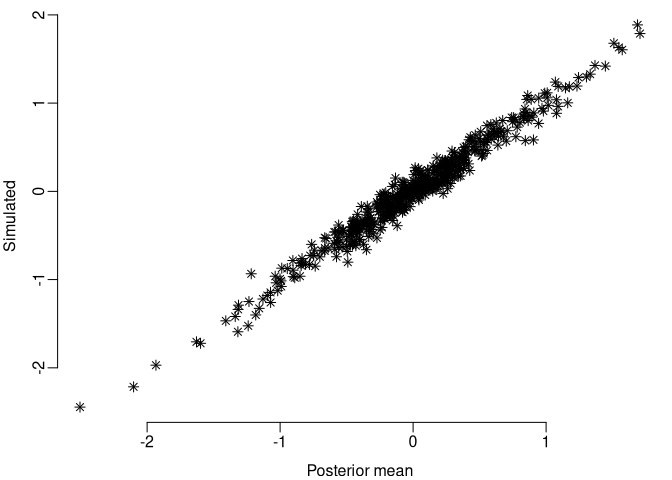

<!-- README.md is generated from README.Rmd. Please edit that file -->

# INLAtools

<!-- badges: start -->

[](https://cran.r-project.org/package=INLAtools)
[](https://cran.r-project.org/package=INLAtools)
<!-- badges: end -->

Contain code to work with a C struct, in short cgeneric, to define a
Gaussian Markov random (GMRF) model. The cgeneric contain required data
to specify GMRF elements such as the graph and the precision matrix, as
well hyper-parameters definition, such as initial values and the prior,
which are useful for model inference. It can be accessed from a C
program and is the recommended way to implement new GMRF models in the
‘INLA’ package (<https://www.r-inla.org>). We also provide access from
R, useful for code debug and evaluate the prior for multiple parameter
sets. The implemented functionalities leverage the use of ‘cgeneric’
models. In order to illustrate it, a model named `generic0` is included.
It can be used to implement intrinsic models and scale it by default, as
proposed in Sørbye & Rue (2014) <doi:10.1016/j.spasta.2013.06.004>, as
well defining the required constraints. A very useful functionality is
the Kronecker product method that creates a new model from multiple
cgeneric models. It also works with the rgeneric, the R version of the
cgeneric intended to easy try implementation of new GMRF models before
making it for production. The constraints of a Kronecker between two
cgeneric models, such as spatio-temporal intrinsic interaction models,
see [Knorr-Held
(2000)](https://onlinelibrary.wiley.com/doi/10.1002/1097-0258%2820000915/30%2919%3A17/18%3C2555%3A%3AAID-SIM587%3E3.0.CO%3B2-%23),
are automatically set, as shown in the example bellow.

## Installation

The ‘INLA’ package suggested for model fitting. You can install it with

``` r
install.packages(
  pkgs = "INLA",
  repos = c(
    getOption("repos"),
    INLA="https://inla.r-inla-download.org/R/testing"), 
  dependencies = TRUE) 
```

You can install the current [CRAN](https://CRAN.R-project.org) version
of INLAtools:

``` r
install.packages("INLAtools")
```

You can install the latest version of INLAtools from
[GitHub](https://github.com/eliaskrainski/INLAtools) with

``` r
if(!require(pak)) install.packages("pak")
pak::pkg_install("eliaskrainski/INLAtools")
```

## Example:

Build a Kronecker product model where the precision is given as
$$ \mathbf{Q} = \tau \mathbf{R}_1 \otimes \mathbf{R}_2 $$

``` r
library(Matrix)
## first
n1 <- 15
(R1 <- crossprod(diff(Diagonal(n1), differences = 2)))
#> 15 x 15 sparse Matrix of class "dsCMatrix"
#>                                                   
#>  [1,]  1 -2  1  .  .  .  .  .  .  .  .  .  .  .  .
#>  [2,] -2  5 -4  1  .  .  .  .  .  .  .  .  .  .  .
#>  [3,]  1 -4  6 -4  1  .  .  .  .  .  .  .  .  .  .
#>  [4,]  .  1 -4  6 -4  1  .  .  .  .  .  .  .  .  .
#>  [5,]  .  .  1 -4  6 -4  1  .  .  .  .  .  .  .  .
#>  [6,]  .  .  .  1 -4  6 -4  1  .  .  .  .  .  .  .
#>  [7,]  .  .  .  .  1 -4  6 -4  1  .  .  .  .  .  .
#>  [8,]  .  .  .  .  .  1 -4  6 -4  1  .  .  .  .  .
#>  [9,]  .  .  .  .  .  .  1 -4  6 -4  1  .  .  .  .
#> [10,]  .  .  .  .  .  .  .  1 -4  6 -4  1  .  .  .
#> [11,]  .  .  .  .  .  .  .  .  1 -4  6 -4  1  .  .
#> [12,]  .  .  .  .  .  .  .  .  .  1 -4  6 -4  1  .
#> [13,]  .  .  .  .  .  .  .  .  .  .  1 -4  6 -4  1
#> [14,]  .  .  .  .  .  .  .  .  .  .  .  1 -4  5 -2
#> [15,]  .  .  .  .  .  .  .  .  .  .  .  .  1 -2  1
```

``` r
G2 <- sparseMatrix(
  i = c(1,1,2,2,3,3,6), 
  j = c(2,3,4,6,4,5,7), 
  symmetric = TRUE)
(n2 <- nrow(G2)) 
#> [1] 7
R2 <- Diagonal(n = n2, x = colSums(G2)) - G2
R2
#> 7 x 7 sparse Matrix of class "dsCMatrix"
#>                          
#> [1,]  2 -1 -1  .  .  .  .
#> [2,] -1  3  . -1  . -1  .
#> [3,] -1  .  3 -1 -1  .  .
#> [4,]  . -1 -1  2  .  .  .
#> [5,]  .  . -1  .  1  .  .
#> [6,]  . -1  .  .  .  2 -1
#> [7,]  .  .  .  .  . -1  1
```

``` r
image(kronecker(R1, R2))
```



Notice that the order of the resulting matrix.

## Define the `cgeneric` models

We will use the ‘cgeneric0’ model for each. This model is written with
precision matrix equal $\tau \mathbf{R}$ where the matrix $\mathbf{R}$
is the precision structure matrix and $\tau$ is the precision parameter.
A precision parameter multiplied by a precision structure is a local
precision.

``` r
library(INLAtools)
#> Welcome to the INLAtools package!
#> More at eliaskrainski.github.io/INLAtools
cg1 <- cgeneric(
    model = "generic0", 
    R = R1, ## precision structure matrix
    param = c(1, 0.05)) ## P(sigma > 1) = 0.05
```

where the prior is a PC-prior, as proposed in [Simpson et.
al. (2017)](https://projecteuclid.org/journals/statistical-science/volume-32/issue-1/Penalising-Model-Component-Complexity--A-Principled-Practical-Approach-to/10.1214/16-STS576.full).

Notice that this model is intrinsically stationary, so that using it as
prior makes it an improper prior. The usual way to make it proper is to
account for its null space and define a constraint. It is done by
default (`constr = TRUE`) and the returned object already contain the
‘extraconstr’ to set it:

``` r
str(cg1$f$extraconstr)
#> List of 2
#>  $ A: num [1:2, 1:15] 0.4887 -0.053 0.4416 -0.0163 0.3944 ...
#>  $ e: num [1:2] 0 0
```

The implemented method to define such a constraint has complexity of
$\mathcal{O}(n^3)$ because it perform the singular value decomposition.
This is also used to scale the model. This scaling, as proposed in
[Sørbye & Rue
(2014)](https://www.sciencedirect.com/science/article/pii/S2211675313000407),
is applied by default (`scale = TRUE`) and requires the generalized
inverse of the $\textbf{R}$ matrix.

If one know already what is the null space, it can be used in the
`extraconstr` argument. Also, the `INLA` package provides a
computationally efficient way to scale the model. Therefore, for large
structure matrices, the better is to 1) define a constraint with a known
null space, 2) use it in `INLA::inla.scale.model()` to scale the model
3) use both to define the `cgneric` model. We will do this procedure for
the second model.

For the second model we also use the `cgeneric0` but fix the parameter
to 1, leaving the precision matrix from the first model as the one for
the resulting precision matrix. Instead of using `scale = TRUE` and
`constr = TRUE` (default), we consider an efficient (for larger models)
way:

``` r
Ae2 <- list(A = matrix(1, 1, ncol(R2)), e=0) ## sum-to-zero constraint
R2scaled <- INLA:::inla.scale.model(Q = R2, constr = Ae2)
cg2 <- cgeneric(
  model = "generic0", 
  R = R2scaled, 
  param = c(1, NA), ## fix the precision/variance parameter
  extraconstr = Ae2,
  scale = FALSE, ### already scaled
  constr = FALSE ## already accounted
)
str(cg2$f$extraconstr)
#> List of 2
#>  $ A: num [1, 1:7] 1 1 1 1 1 1 1
#>  $ e: num 0
```

The resulting Kronecker product model is

``` r
cg12 <- kronecker(cg1, cg2)
(N <- cg12$f$n)
#> [1] 105
```

Because each of the two model has one constraint, this new `cgeneric`
model account for multiple constraints, the set of constraints in one
model is replicated along each dimension of the other one. In the case
of the resulting set of constraint contain redundant ones, these are
removed. For the our example, the final number of constraints is
$n_2+n_1-1$:

``` r
str(cg12$f$extraconstr)
#> List of 2
#>  $ A: num [1:27, 1:105] 0.489 0 0 0 0 ...
#>  $ e: num [1:27] 0 0 0 0 0 0 0 0 0 0 ...
```

``` r
tau <- 4
Q <- cgeneric_Q(cg12, theta = log(tau))
image(Q)
```



Note: the scaling makes $\sigma = \tau^{-0.5}$ a marginal standard
deviation parameter.

## Fit the model to some data

Simulate $k=5$ samples (replicates) from the Kronecker product model

``` r
library(INLA)
k <- 5
xx <- inla.qsample(
  n = k, 
  Q = Q + Diagonal(N, 1e-9), 
  constr = cg12$f$extraconstr, 
  seed = 1
)
apply(xx, 2, summary)
#>              sample:1      sample:2      sample:3      sample:4      sample:5
#> Min.    -2.445529e+00 -1.591511e+00 -8.281706e-01 -2.215546e+00 -1.014936e+00
#> 1st Qu. -4.321341e-01 -2.807321e-01 -2.315056e-01 -3.950380e-01 -2.194770e-01
#> Median   9.715881e-03  2.304194e-02  1.387111e-02 -2.470971e-02  1.311282e-02
#> Mean     1.673773e-11 -1.447892e-10 -2.221746e-10  1.311346e-11 -1.291080e-10
#> 3rd Qu.  3.874456e-01  2.783813e-01  2.209574e-01  4.298453e-01  2.364824e-01
#> Max.     1.886870e+00  1.427273e+00  1.042149e+00  1.788412e+00  1.604736e+00
```

Plot each replicate per group

``` r
dataf <- data.frame(
  i1 = rep(rep(1:n1, each = n2), k),
  i2 = factor(rep(rep(1:n2, n1), k)),
  i = rep(1:N, k), 
  r = rep(1:k, each = N),
  x = as.vector(xx)
)
head(dataf, 10)
#>    i1 i2  i r           x
#> 1   1  1  1 1  0.88939753
#> 2   1  2  2 1  0.34887895
#> 3   1  3  3 1  0.19867057
#> 4   1  4  4 1  1.29002557
#> 5   1  5  5 1 -0.44791119
#> 6   1  6  6 1 -0.30868429
#> 7   1  7  7 1 -1.97037714
#> 8   2  1  8 1  0.72810764
#> 9   2  2  9 1  0.30954044
#> 10  2  3 10 1  0.07878453

library(ggplot2)
ggplot(dataf) + theme_minimal() + 
  geom_line(aes(x = i1, y = x, group = i2, color = i2)) + 
  facet_wrap(~r)
```



Simulate observations considering a Poisson model as

``` r
dataf$y <- rpois(N * k, exp(3 + dataf$x))
```

Fit the model with a call to the main `INLA` function:

``` r
fit <- inla(
    formula = y ~ f(i, model = cg12, replicate = r),
    family = "poisson", 
    data = dataf)
```

Summary of the intercept and $\tau$ posterior marginals

``` r
fit$summary.fixed
#>                 mean         sd 0.025quant 0.5quant 0.975quant     mode
#> (Intercept) 3.005227 0.01034422   2.984938 3.005229   3.025506 3.005229
#>                      kld
#> (Intercept) 5.810311e-11
fit$summary.hyperpar
#>                 mean        sd 0.025quant 0.5quant 0.975quant     mode
#> Theta1 for i 1.26717 0.1489089  0.9732551 1.267941   1.556859 1.269471
```

Scatterplot of the posterior mode and simulated

``` r
par(mar = c(3,3,0.5,0.5), mgp = c(2,0.5,0), bty = "n")
plot(fit$summary.random$i$mean, xx, pch = 8,
     xlab = "Posterior mean", ylab = "Simulated")
```



Posterior marginal summary for $\sigma=\tau^{-1/2}$:

``` r
pm.sigma <- inla.tmarginal(
  fun = function(x) exp(-x/2), ## from log(tau) to sigma
  marginal = fit$internal.marginals.hyperpar[[1]])
1/sqrt(tau)
#> [1] 0.5
inla.zmarginal(pm.sigma)
#> Mean            0.532132 
#> Stdev           0.0394443 
#> Quantile  0.025 0.459363 
#> Quantile  0.25  0.504553 
#> Quantile  0.5   0.530415 
#> Quantile  0.75  0.557795 
#> Quantile  0.975 0.614219
```
